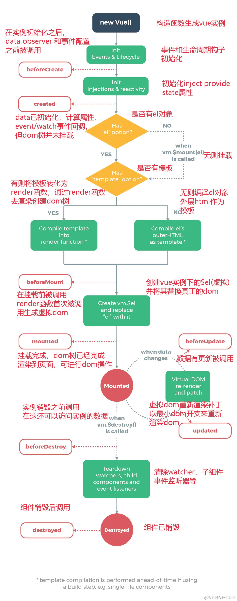

1. 创建阶段
   - beforeCreate：组件创建前，data 和 methods 还未被初始化。
   - created：组件实例被创建，data 和 methods 初始化，但无法操作 DOM。
2. 挂载阶段
   - beforeMount：模版渲染，相关 render 函数首次被调用，模版在内存中被编译好，但未挂载到页面中，无法操作 DOM。
   - mounted：实例被挂载到 DOM 上，可以访问与操作 DOM。
3. 更新阶段
   - beforeUpdate：数据更新时调用。可以访问更新前的 DOM.
   - updated：数据更改导致虚拟 DOM 重新渲染和打补丁以最小 DOM 开支来重新熏染 DOM。可以访问更新后的 DOM。
4. 销毁阶段
   - beforeDestroy：实例销毁前调用。实例仍可以用，可以访问所有数据和 DOM。
   - destroyed：实例销毁后调用，所有时间监听器被移除，所有子实例也被销毁，无法访问 DOM 和数据。

父子组件生命周期
- 挂载阶段：父组件 beforeMount -> 子组件 created -> 子组件 mounted -> 父组件 mounted
- 更新阶段：父组件 beforeUpdate -> 子组件 beforeUpdate -> 子组件 updated -> 父组件 updated
- 父组件 beforeDestroy -> 子组件 beforeDestroy -> 子组件 destroyed -> 父组件 destroyed

兄弟组件的生命周期
-
