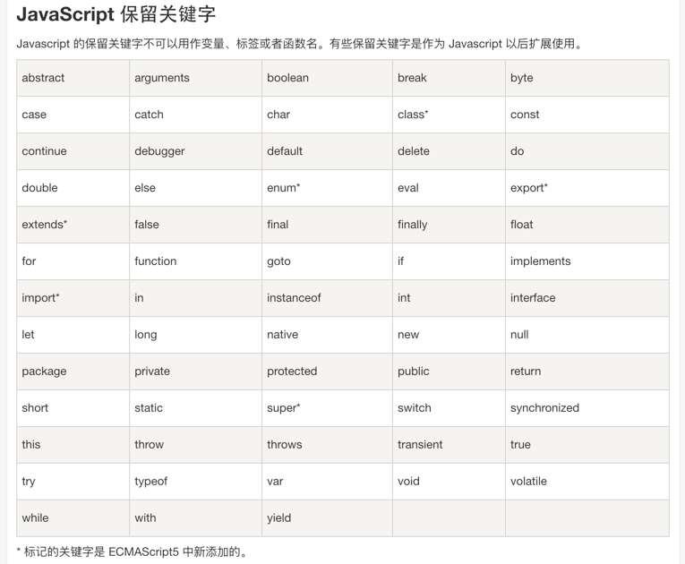
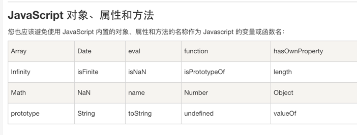

1. 以下哪些表达式的值为0 - ABCD
   - A. (()=>{}).length (获取方法形参个数，形参为0)
   - B. 1 & 2 (按位与运算，同为1才为1，否则为0)
   - C. +[] (隐式类型转换，+’‘=== 0)
   - D. [1,2,-3].reduce((a, b) => a - b, 0) (0 - 1 - 2 - -3 = 0)

2. 行内元素，是无法设置高宽度的，脱离文档流就变成了块级元素支持宽高，但会发生内容塌陷，如果没内容就是0，若设置高度就按设置的

3. 

4. 如果要在10秒后调用checkState，下列哪行代码是正确的 B
   - A. window.setTimeout(checkState, 10);
   - B. window.setTimeout(checkState, 10000);
   - C. window.setTimeout(checkState(), 10);
   - D. window.setTimeout(checkState(), 10000);
   - 语法：setTimeout(function, delay, [arg1, arg2, ...])
     - 第一个参数必须是函数或字符串
     - checkState 表示查看函数完整信息，即查看整个函数体
     - checkState() 如果函数名后面加上圆括号就表示立即调用（执行）这个函数里面的代码（花括号部分的代码）

5. 
> let array = [,1,,2,,3]。    
array = array.map((i) => ++i)  
返回结果

[,2,,3,,4]
>  foreach()，filter()，reduce()，every()，和some()都会跳过空位。    
map()会跳过空位，但会保留这个值    
join() 和 toString() 会将空位视为undefined，而undefined和null会被处理成空字符串。    
ES6 中都会将空位当做undefined

6. JavaScript 写在 HTML 代码中的哪一部分，会导致页面在加载的时候自身被执行
   - 放在<head>部分会先加载完js再加载页面
   - 放在<body>部分会在加载页面时候加载 

7. 以下JS代码会输出什么
   > var a = 10;   
   (function a() {   
      a = 20;   
      console.log(a);   
   })()

   输出函数a的内容
   - 立即执行函数如果有函数名，那么函数体内不可以修改函数名。也不会报错，就是无效。

8. 以下哪些方法会返回一个数组？
- Object.keys() （返回由键组成的数组）
- String.prototype.split() （split() 方法使用指定的分隔符字符串将一个String对象分割成字符串数组）
- Array.prototype.join() （join() 方法将一个数组（或一个类数组对象）的所有元素连接成一个字符串并返回这个字符串）
- Promise.all() （失败返回的是promise对象）