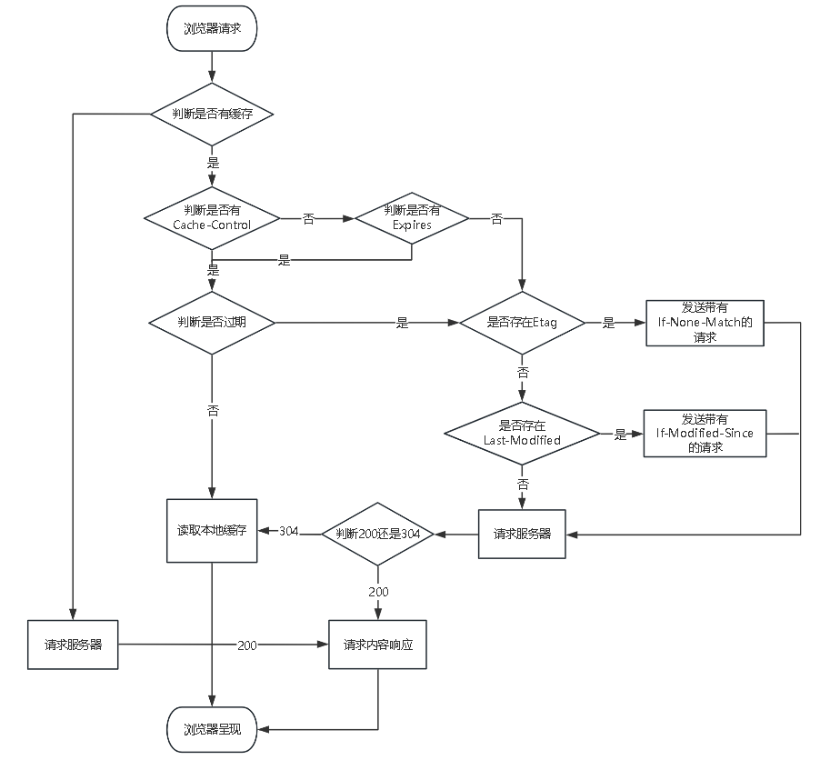

## 后台和前台的http交互

---

1. HTTP 发展
   1. HTTP 0.9
      - 只有一个命令 GET（80端口）
        - GET/index.html
        - TCP连接建立后，客户端向服务器请求网页 index.html
        - 服务器也不必返回响应头，直接返回数据
        - 返回的文件内容是以 ASCII 字符流来传输的
   2. HTTP 1.0
      - 目的
        - 浏览器展示不单是HTML文件，还包括多种类型的文件，因此需要多种类型的文件下载
        - 文件格式不单只有 ASCII 编码，还有很多其他类型编码的文件
      - 新增特性
        - 通过请求头和响应头协商数据的传输，发起请求时会通过HTTP请求头告诉服务器它希望返回数据的什么样
        - 引入状态码，告诉浏览器请求服务器的响应状态
        - 提供 Cache 机制，缓存已经下载过的文件减轻服务器的压力
        - 加入用户代理的字段以统计客户端的基础信息（User-Agent）
      - 缺陷
        - 只规定了浏览器与服务器只保持短暂的连接，浏览器每次请求都会建立一个TCP连接，但每次服务器完成请求处理后会立刻断开TCP连接
          - 解决方法：请求时使用Connection：keep-alive
            - 缺点：不是标准的字段，不同实现的行为可能不一致
        - 队头阻塞，就是一个请求因为某种原因被阻塞时，在后面排队的所有请求也一并被阻塞
   3. HTTP 1.1
      - 目的
        - HTTP 1.0 满足不了需求了
      - 新增特性
        - 改进持久连接
          - TCP连接上可以传输多个HTTP请求，只要浏览器或服务器没有明确的要断开，该TCP连接就会一直保持。
          - 同一域名，默认允许同时建立6个TCP持久连接
          - 使用 CDN 实现域名分片机制
        - 不成熟的HTTP管道化
          - 允许客户端不用等待上一次请求结果返回，就可以发出下一次请求，但服务器依旧需要根据请求的顺序来回复请求。
        - 提供虚拟主机的支持
          - 在1.0期间，不支持HOST请求头字段，web浏览器无法使用主机名来明确访问服务器上的哪个web站点，这样就无法使用web服务器在同一IP地址和端口号配置多个虚拟的web站点
          - 请求头增加了 Host 字段，用来表示当前的域名地址
        - 分块传输机制
          - 1.0需要设置完整的数据大小，但很多内容是动态生成的不知道数据的最终长度
          - 服务器会将数据分割成若干个任意大小的数据块，每个数据块发送时会附上上个数据块的长度
        - 客户端 Cookie、安全机制，最后使用一个零长度的块作为发送数据完成的标志
      - 缺陷
        - 仍会出现队头堵塞的现象
   4. HTTP 2.0（以SPDY协议为基础）
      - 出现原因
        - HTTP 1.1 对带宽的利用率不理想，原因
          - TCP 的慢启动
          - 同时开启了多条 TCP 连接，这些连接会竞争固定带宽
            - 多条TCP连接在带宽不足的时候会减缓这些连接的速度，多条TCP连接之间不能协商让哪些关键资源优先下载，影响关键资源的下载速度
          - 队头阻塞的问题
          - 协议开销大
            - header 里携带的内容过大，且不能压缩，增加了传输成本
      - 一个域名使用一个TCP长连接传输数据，只需要一次慢启动，使用资源并行请求解决对头阻塞问题
      - 新增特性
        - 二进制传输
          - 2.0将请求和响应数据分为更小的帧，并把它们采用二进制编码。多个帧之间可以乱序发送，根据帧首部的流标识可以重新组装
        - Header 压缩
          - 使用首部表来跟踪和存储之前发送的键值对，对于相同行数据，不再通过每次请求和相应发送，当有新的会追加到当前表的末尾或替换表中之前的值
        - 多路复用
          - 解决了浏览器限制同一个域名下的请求数量的问题
            - 同域名下所有通信都在单个连接上完成
            - 单个连接可以承载任意数量的双向数据流
            - 数据流以消息的形式发送，而消息又由一个或多个帧组成，多个帧之间可以乱序发送，根据帧首部的标识符重新组装
        - 设置优先级
          -  每个请求都可以带一个 31 bit的优先值，0表示最高优先级，数值越大，优先级越低。客户端和服务端可以在处理不同流时采用不同的策略，以最优的方式发送流、消息和帧
        - 服务器推送
          - 2.0可以直接将数据提前推送到浏览器。提前给客户端推送必要的资源，这样就可以相对减少一点延迟时间
      - 缺陷
        - TCP 的队头阻塞并没有彻底解决
          - 当出现丢包的时候，TCP为了可靠传输，有个丢包机制，就是丢失的包必须要等待重新传输确认，而整个TCP都要开始等待重传，就会阻塞TCP中的所有请求。
        - TCP 以及 TCP+TLS 建立连接的延时
          - TLS也需要一个握手过程
        - 多路复用导致服务器压力增大
        - 多路复用容易超时
          - 大批量的请求同时发送，由于 2.0 连接内存在多个并行的流，而网络带宽和服务器资源有限，每个流的资源会被稀释，虽然它们开始时间相差更短，但却都可能超时。
   5. HTTP 3.0
      - QUIC（基于UDP协议）（TCP + HTTPS + HTTP 2.0）
        - 连接迁移
          - TCP 是按四要素（源IP、源端口、目的IP、目的端口）确定一个连接的，而QUIC只是让客户端生成一个 Connection ID（64位）来区别不同连接，只要ID不骗，连接就不需要重新建立，即使客户端网络发生变化。
        - 低连接延时
          - QUIC 由于基于 UDP，无需 TCP 连接，在最好情况下，短连接下 QUIC 可以做到 0RTT 开启数据传输
        - 可自定义的拥塞控制
          - QUIC 传输控制不在依赖内核的拥塞控制算法，而是实现在应用层上，这意味着可以根据不同的业务场景，实现和配置不同的拥塞控制算法以及参数
        - 无队头阻塞
          - Packet Number单调递增
            - 乱序确定，确保当前窗口可以继续滑动
          - Stream ID和Stream Offset字段
            - Stream ID 来标识当前数据流属于哪个资源请求
            - Stream Offset 标识当前数据包在当前 Stream ID 中的字节偏移量
          - 非连续的数据包确认
            - 通过两个数据包的 Stream ID 与 Stream Offset 都一致，就说明这两个数据包的内容一致

2. HTTP报文
   - 请求报文
     - 请求方式
       - GET 请求获取资源
       - POST 传输实体的主体
         - POST 和 GET 的区别
           - GET主要用于获取数据，POST主要用于提交和更新数据
           - GET请求参数在URL中，POST请求参数在请求体中
           - GET请求有传输大小的限制，POST传输的数据没有大小限制，或者限制非常大
           - GET参数在URL中，不安全，POST请求安全
           - GET请求会把 headers 和 data 一起发送出去，POST是先发 header，服务器响应200后，再发送 data
       - HEAD 获取报文首部
       - PUT 传输文件，请求服务器存储一个资源
       - DELETE 删除资源
       - OPTIONS 查询指定资源支持的方法
       - TRACE 跟踪请求要经过的防火墙、代理或网关，主要用于测试或诊断
       - CONNECT 通过代理服务器建立到目标服务器的隧道连接
     
     - 请求头
       - Accept 指明服务器能发送的媒体类型（对标服务端返回的Content-Type）
       - Accept-Charset 支持使用的字符集
       - Accept-Encoding 支持使用的编码方式（gzip, deflate, br）
       - Accept-Language 支持使用语言
       
       - Expect 告诉服务器能够发送来哪些媒体类型
       - If-Modified-Since 是否在指定时间以来修改过此资源
       - If-None-Match：对应服务端 Etag，用于匹配文件内容是否改变
       
       - Authorization 客户端提交给服务端的认证数据
       - Cookie 客户端发送给服务端的身份标识
       
       - Host 请求的主机名和端口号
       - Range 请求实体的字节范围
       - Referer 知名请求当前资源的原始资源的URL
       - User-Agent 用户代理，使用什么工具发出请求
       
       - Origin 表明预检请求或实际请求的源站
       - Access-Control-Request-Method 将实际请求所使用的HTTP方式告诉给服务器
       - Access-Control-Request-Headers 将实际请求所携带的首部字段告诉服务器
       
       - Connection 管理连接状态
       - Cache-Control 缓存管理
       - Content-Length 实体长度
       - Content-Type 实体的媒体长度
       - Via 报文经过的中间节点
       
     - 响应头
       - Access-Control-Allow-Credentials 指定实际请求是否可以使用 credentials
       - Access-Control-Expose-Headers 
       - Access-Control-Allow-Methods  指明了实际请求所允许使用的 HTTP 方法
       - Access-Control-Allow-Origin
       - Access-Control-Allow-Headers 指明了实际请求中允许携带的首部字段
       - Access-Control-Max-Age 指定了预检请求的结果能够被缓存多久（秒）
       - Age 响应持续时间
       - Allow 允许对此资源使用的请求方法
       
       - Content-Disposition 作为网页或作为网页的一部分或作为附件下载并且本地保存。(attachment;filename=index.doc)
       - Content-Encoding 支持的编码
       - Content-Language： 持的自然语言
       - Content-Length 文本长度
       - Content-Location 资源所在位置
       - Content-Range 在整个资源中此实体表示的字节范围
       - Content-Type 主体的对象类型
       
       - Accept-Ranges 服务器所能接受的范围类型
       - Vary 首部列表，服务器会根据列表中的内容挑选出最适合的版本发送给客户端 跟安全相关的响应首部
       - Set-Cookie 服务器端在第一次请求时发送令牌
       - WWW-Authentication 质询，即要求客户提供帐号和密码
       
       - ETag 协商缓存的强效校验器，若给定URL处的资源发生改变，则ETag必须生成新值
       - Expires 资源过期时间，强缓存控制字段
       - Last-Modified 上一次修改时间
       - Date 消息产生的时间

3. HTTP状态码
   - 1xx 请求正在处理中
   - 2xx 请求完成
     - 200 成功
     - 204 成功，但无返回
     - 206 范围返回，范围请求
   - 3xx 请求需要附加操作完成
     - 301 永久重定向
     - 302 临时重定向
     - 303 请求支援存在另一个URL，重定向到另一个URL
     - 304 服务端资源未改变，可以直接使用客户端未过期的缓存
   - 4xx 请求失败，服务端无法处理请求
     - 400 请求失败
     - 401 未认证
     - 403 服务器拒接访问
   - 5xx 服务端处理请求出错
     - 500 执行请求出错
     - 501 服务器繁忙，没时间

4. HTTP存储
   - cookie 
     - 用于 session 会话状态管理
       - 客户端发送登录信息，
       - 服务端会发放一个 Session ID，让它与登录信息绑定，并记录在服务端
       - 然后服务端做出响应时会在 Set-Cookie 内写入 Session ID
       - 然后客户端接收 Session ID 后，将其作为 Cookie 保存在本地
       - 之后就会自动带上 cookie，自动校验，无需二次登录
     - 某些场景的优化
       - 静态资源不需要带上 cookie（多域名拆分）
         - 将静态资源分组，分别放在不同的域名下
         - 在不同域名下请求是不会带上其他域名的 cookie
     - 缺点
       - 容量较小，大概 4k
       - 性能缺陷，请求头带数据，流量会增加，Cookie 紧跟域名，无论域名下面的地址需不需要 Cookie 都会发送，造成性能浪费
       - 安全缺陷，容易被截获篡改，当 HttpOnly 为 false，Cookie 能通过 JS 脚本获取
       - 操作缺陷，Cookie的原生api不友好，需要自行封装
     - 参数
       - key cookie key
       - value cookie value
       - expires 过期时间，一旦过期浏览器自动删除 cookie，不设置过期时间默认为会话期间
       - path 路径，凡是来自同一服务器，URL中有相同路径的所有 Web页面的 cookie 共享
       - domain 主机名，同一域名下的拨不同主机。通常一个主机的 cookie 不能被另一个主机访问，但通过 domain 设置，可以让顶级域名下的子域名都可访问 cookie
       - secure 为 true 时，只能在 https 协议下才能上传到服务器
       - httponly 用于防止客户端脚本通过 document.cookie 属性访问 Cookie

   - webStorage
     - localStorage
       - 以键值对的方式存储，永久存储，永不失效，除非手动删除，同域的新网页都可访问，大小约 5M
       - API
       ```JS
       window.localStorage.username = 'hehe'                // 设置
       window.localStorage.setItem('username', 'hehe')      // 设置
       window.localStorage.getItem('username')              // 读取
       window.localStorage.removeItem('username')           // 删除
       window.localStorage.key(1)                           // 读取索引为1的值
       window.localStorage.clear()
       ```
     - sessionStorage
       - 仅当前浏览器窜口关闭前有效
       - 数据只在页面会话期间有效，关闭后数据清除，而且即使多个标签页访问的是同一域名下的同一页面，也不会共享
       - API
       ```JS
       window.sessionStorage.username = 'hehe'                // 设置
       window.sessionStorage.setItem('username', 'hehe')      // 设置
       window.sessionStorage.getItem('username')              // 读取
       window.sessionStorage.removeItem('username')           // 删除
       window.sessionStorage.key(1)                           // 读取索引为1的值
       window.sessionStorage.clear()
       ```
   - indexedDB
     - IndexedDB 是一种低级 API，用于客户端存储大量结构化数据。该 API 使用索引来实现对该数据的高性能搜索。
     - 始终有效，窗口或浏览器关闭也一直保存
     - 所有同源窗口中都是共享的

5. HTTPS
   - 加密方案：在TCP和HTTP之间插入一层安全层，对HTTP发起的请求进行加密，对接收的内容进行解密
   - 通信步骤
     - 第一次 HTTP 请求
     1. 客户端向服务器发起HTTPS请求，连接到服务器的 443 端口
     2. 服务端将包含公钥的证书发送给客户端
     3. 客户端接收到证书验证其合法性和有效性，若不通过，则显示HTTPS警告信息
     4. 客户端生成一个随机数，然后用证书中的公钥进行加密
     5. 利用一系列算法结合随机数生成 session key
     - 第二次 HTTP请求
     1. 将加密之后的客户端密钥发送给服务器
     2. 服务器接收后用自己的私钥进行解密，解密之后的随机数用和浏览器相同规则生成 session key，并用此对数据进行加密，将数据变为密文
     3. 服务器将加密后的密文发送给客户端
     4. 客户端收到服务器发送来的密文，用客户端的 session key 对其进行对称解密，得到服务器发送的数据
     - 之后所有的 https 通信数据将由之前浏览器生成的 session key 并利用对称加密算法进行加密
   
   - HTTPS = HTTP + 通信加密 + 证书认证 + 报文的完整性检测
     - 通信加密
       - 对称加密：使用同一个密钥
         - 缺点
         - 由于需要相同密钥，不能保障密钥不被截获，安全性不能保障
         - 需要使用唯一密钥，密钥管理困难
       - 非对称加密：使用公钥加密，使用私钥解密
         - pis：交换密钥时使用非对称加密，通信时使用对称加密
     
     - 数字证书
       - 要求受信任的第三方，将公钥合并到数字证书中，然后服务器将公钥和证书发给客户端
       - 确保公钥的所有权和身份的真实性，防止中间人攻击
     - 数字签名
       - 用于验证数字文档完整性和来源
       - 步骤
         - 哈希处理：对原始数据进行哈希处理，获取哈希值
         - 私钥加密，使用发送者（一般是第三方）的私钥对这个哈希值加密，生成数字签名
         - 发送：将原始数据和数字签名发送给接收方
         - 验证：接收方使用发送者的公钥（第三方的公钥已事先植入浏览器中了）解密数字签名，将得到的原始值进行哈希处理，生成新的哈希值
         - 比较：若解密后的哈希值和新哈希值相同，则来源可信
     - 证书链
       - 建立从一个证书到另一个证书的信任关系
       - 服务器证书：服务器的数字证书。
       - 中间证书：由其他CA颁发的证书，用于验证服务器证书的颁发机构。
       - 根证书：最高级别的CA颁发的证书，客户端内置或用户信任的证书。
       - 由上层证书给下层证书颁发证书和数字签名，下层证书找上层证书认证，最后认证到根证书

6. HTTP攻击
   - 跨站脚本攻击（XSS）：在网页中注入恶意脚本，当访问该网页时，脚本就会执行
     - 原因
       - 页面引用第三方资源
       - 跨域资源
     - 方式
       - 存储型：通过在数据库插入恶意代码，如有发帖评论这些的，当显示这些时，就会执行恶意代码
       - 反射型：攻击者将恶意JS脚本作为用户发送给网站请求中的一部，然后网站又把恶意脚本返回给用户，这时候就会在页面中被执行
       - 基于DOM：在 Web 资源传输过程或者在用户使用页面的过程中修改 Web 页面的数据。
     - 防御
       - 防止 Cookie 被盗用，使用 HttpOnly 属性
       - 服务器对输入脚本进行过滤或转码
       - 使用CSP，就是白名单，告诉浏览器哪些外部资源可以加载执行
       - 验证码
       
   - 跨站请求伪造（CSRF）：利用用户的登录状态发起跨站请求         
     - 原因
       - 简单的身份验证只能保证请求发自某个用户的浏览器，却不能保证请求本身是用户自愿发出的
     - 方式
       - 自动发起 Get 请求
       - 自动发起 POST 请求
       - 引诱用户点击链接
       - 用户在信任的网站留下了状态，访问黑客的网站后，黑客就获取到了信任网站的登录状态进而伪造带有正确 Cookie 的 http 请求
     - 防御
       - 验证请求的来源站点：根据http请求头中的 Origin 或 Referer，判断是否为允许访问的站点，进而对请求进行过滤，优先判断 Origin，若二者都不存在就阻止。
       - 在Cookie信息中添加 SameSite
         - strict：完全禁止使用 Cookie
         - lax 允许部分情况使用 Cookie，
         - none 任何情况都可以发送 Cookie，但必须设置 Secure
       - Token验证：服务器向用户返回一个随机数Token，再次请求时在请求头中以参数的形式添加入这个Token，然后服务器验证这个Token
       - 验证码
       
   - SQL注入攻击：在输入字段插入恶意SQL代码（如 ‘page=1’），从而扰乱SQL语句，干扰数据库
   - 点击劫持：在网页中嵌入透明的iframe，导致用户点击了隐藏的内容
   - 会话劫持：窃取用户的 Session ID，进而冒充用户
   - 目录遍历：攻击者通过操纵文件路径获取服务器上未经授权的文件。（如img中的src）
   - 中间人攻击：截获两方通信并修改。
   - DNS缓存投毒：攻击用户的DNS缓存，对DNS缓存中的域名映射关系进行篡改，将域名解析结果指向一个虚假的IP

7. HTTP缓存
   - 缓存类型
     - 强缓存
       - 浏览器如果判断本地缓存未过期，就直接使用，无需发起http请求，返回码 200
     - 协商缓存
       - 浏览器会向服务端发起http请求，然后服务端告诉浏览器文件未改变，让浏览器使用本地缓存，返回码 304 
   - 大致过程
     
   - 缓存首部字段
     - 通用首部字段
       - Cache-Control 控制缓存具体行为
       - Pragma 1.0的字段，当值为 no-cache 需要强制验证缓存
         - 优先级很高，但仅在IE上才能识别它在 meta 上的含义，服务端响应添加 Pragma: no-cache，浏览器表现行为和强制刷新类似。
       
       - Date 创建报文的日期
         - 静态资源Age + 静态资源Date = 原服务端Date
       
     - 响应首部字段
       - ETag 服务器生成资源的唯一标识符
         - 一般与 If-None-Match 配对
         
       - Vary 代理服务器缓存的管理信息
         - 区别不同的客户端
         
       - Age 资源在缓存代理中存贮的时长
         - 用来区分请求的资源来自源服务器还是缓存服务器的缓存的
       
     - 请求首部字段
       - If-Match 比较ETag是否一致
         - 仅在请求的资源满足此首部列出的 ETag 之一时才会返回资源，而对 PUT 等其他的来说，满足条件才能资源上传
         - GET，HEAD 搭配 Range 首部使用，确保在范围内的请求是同一范围内的资源请求，不匹配返回 416（范围请求无法满足）
         - PUT，可以避免更新丢失问题，条件不满足返回 412
         
       - If-None-Match 比较ETag是否不一致
         - GET请求中，当服务器没有与之匹配的返回 200，有返回 304，POST，PUT等请求，没有返回 412
         
       - If-Modified-Since 比较资源最后更新时间是否一致，与 Last-Modified 配对
         - 验证本地缓存是否可用
         
       - If-Unmodified-Since 比较资源最后更新时间是否不一致
         - 如果文件在两次访问间没有被修改就返回 200 和资源，反之 412（预处理错误）
         - 与含有 If-Range 消息头的范围请求搭配使用，用于断点续传功能
         - POST，PUT等请求，优化并发控制，即当多用户编辑用一份文档的时候，若服务器资源已经修改。那么做出的编辑会被拒绝
         
     - 实体首部字段
       - Expires 告知客户端资源缓存失效的绝对时间
       - Last-Modified 资源最后一次修改的时间，校验字段
         - 缺点：在一秒内的频繁修改无法判断是否真修改了

   - Cache-Control 
     - 请求指令 
       - no-cache 强制源服务器再次验证、
       - no-store 不缓存请求或响应的任何内容
       - max-age 缓存时长，响应的最大的Age值
       - min-fresh 必需的，期望在指定时间内响应仍然有效
       - no-transform 代理不可更改媒体类型
       - only-if-cached 从缓存中获取
     - 响应指令
       - public 任何一方都能缓存该资源
       - private 只能特定用户缓存
       - no-cache 缓存前必须先确认其有效性
       - no-store 不缓存请求或响应的任何内容
       - no-transform 代理不可更改媒体类型
       - must-revalidate 可缓存但必须向原服务器进行确认
       - proxy-revalidate 要求中间缓存服务器对缓存的响应有效性再进行确认
       - max-age 缓存的时长
       - s-maxage 必需的，公共缓存服务器响应的最大Age值
       - cache-extension 新指令标记（token）
       
   - 强缓存
     - 利用 Expires 字段
       - 用 Expires 和当前的请求时间比较，请求时间小于则命中缓存
       - 但用的是服务器返回的绝对时间，容易出问题
     - 利用 Cache-Control 字段
       - 根据它第一次的请求时间和 Cache-Control 设定的有效期，计算出一个资源过期时间，再用这个过期时间和当前请求时间比较
       - 用的都是客户端的时间，是相对时间
   - 协商缓存
     - Last-Modified & If-Modified-Since 控制
       - 第一次请求后返回响应头加上 Last-Modified，再次请求时，请求头会加上 If-Modified-Since，值为上次请求的 Last-Modified
       - 服务器会根据 If-Modified-Since 与资源的最后修改时间比较，若没变化返回 304，且响应头也不加 Last-Modified，但不返回资源内容，有变化，返回资源

     - ETag & If-None-Match 控制
       - 第一次请求时，响应头加上 ETag，这是个唯一标识，只要资源有变化，这个标识就会改变
       - 再次请求，请求头加上 If-None-Match，值为返回的 ETag
       - 服务端根据资源生成 ETag，比较传来的 ETag，没变化，304，且不返回资源内容
       - 304时，ETag 重新生成过，响应头还是要返回这个 ETag
       
   - 启发式缓存
     - 根据响应头中2个时间字段 Date 和 Last-Modified 之间的时间差值，取其值的10%作为缓存时间周期。
     
   - 存储位置
     - service worker
       - 独立于网页的上下文，网页关闭后仍可以运行
       - 充当 Web 应用程序与浏览器之间的代理服务器
       - 功能
         - 离线缓存：可以缓存一些重要资源
         - 推送通知：允许网站向用户发送推送通知
         - 网络代理：可以拦截请求并自定义处理
         - 后台数据同步：网络连接恢复后，可以同步数据
       
     - memory cache
       - 内存中的缓存
       - 主要包含当前页面中已经抓取的资源，关闭了 Tab 就没有了
       - preloader 预加载，可以一边解析，一边请求下一个资源
       
     - disk cache
       - 存储在硬盘中的缓存
       
     - push cache
       - 当以上三种缓存没有命中才被使用，且仅在会话 Session 中存在
     
   - 用户行为的影响
     - 打开新窗口
       - 若指定 cache-control 的值为 private no-cache must-revalidate，都会访问服务器
       - 若指定 max-age 值，在值内时间不会访问服务器

     - 在地址栏回车
       - 值为 private，must-revalidate，只在第一次访问浏览器访问，no-cache，每次都会访问，max-age 在值内时间过期前不访问
     
     - 按后退按钮
       - 值为 private，must-revalidate，max-age，不会重新访问，no-cache 会重新访问
     
     - 按刷新按钮L：F5
       - 会重复访问，不同浏览器处理不同，谷歌是 200 from cache

     - 按强制刷新按钮：Ctrl + F5
       - 重新请求
     
8. 跨域
- 前言：跨域与同源策略
  - 同源
    - 定义
      - 页面的协议，域名和端口都相同，则为同一源，否则为非同一源。

    - 同源策略
      - 限制了一个页面中的脚本只能与同源页面的脚本进行交互，而不能与不同源页面的脚本进行交互。
      - 是为了保护用户的隐私和数据安全的一种浏览器行为。
      - 若缺少同源策略，容易被恶意网站通过脚本非法获取其他网站上的敏感数据，故浏览器用同源策略来限制不同源之间的直接通信。

    - 同源策略限制范围
      + **DOM同源策略**：禁止脚本读取或修改不同源页面的DOM。
      + **cookie、localStorage、indexedDB访问**：禁止脚本访问不同源的存储数据。
      + **XMLHttpRequest**：禁止向不同源的服务器发送AJAX请求。

    - ps：script、img、link等标签不受同源策略限制，虽然都可以加载跨域资源，但浏览器限制了js的权限使其不能读写加载的内容，故引入的文件不会被客户端js获取，故无影响。


- 跨域
  - 定义
    - 协议、域名、端口号其中任意一项不同均属于不同源，跨域是非同源请求，是浏览器根据同源策略对请求的限制，并不是请求没有发出去，请求发送成功了，服务端也把数据返回了，但浏览器为了安全性给拒绝了。

  - 跨域的场景
    + **XMLHttpRequest或Fetch发起的跨源HTTP请求**
    + **Web字体（css中通过@font-face使用跨源字体资源）**
    + **WebGL贴图**
    + **使用drawImage将images/video绘制到canvas**
    + **样式表、脚本等**

  - 产生的条件
    - 由于浏览器同源策略的限制，浏览器会拒绝跨域请求。


- 解决跨域的方法

  1. 跨域资源共享（CORS）
     - 通过在HTTP请求和响应中加入特定的头部信息来工作，从而允许或拒绝跨域请求。
     - 核心是后端通过```Access-Control-Allow-Origin```设置响应头来指定允许的域名，以此来通知浏览器此时的同源策略不生效.

     - CORS请求

       - 简单请求
         - 简单请求的特点是使用GET、HEAD、POST方法，
         - HTTP请求头信息限于几个限定字段
           - Accept
           - Accept-Language
           - Content-Language
           - Last-Event-ID
           - Content-Type：只限于三个值 application/x-www-form-urlencoded， multipart/form-data， ext/plain
       - 非简单请求 
         - 定义：使用GET、POST、HEAD以外的请求方法，或者POST请求中包含非标准的内容类型、自定义请求头等。
         + 预检请求（OPTIONS请求）：在正式通信之前的HTTP请求，浏览器会询问服务器，当前页面所在域名是否在服务器的许可名单之中，以及使用哪些HTTP动词和头部信息段。只有得到肯定答复，浏览器才会正式发请求。
         + 请求头字段说明
           + Access-Control-Allow-Origin：必须。它的值是请求时Origin字段的值，或者是一个*，表示接受任意域名的请求
           + Access-Control-Request-Method：必须。用来列出浏览器的CORS请求会用到哪些HTTP方法。注意，返回的是所有支持的方法，而不单是浏览器请求的那个方法。这是为了避免多次"预检"请求。
           + Access-Control-Request-Headers：必须。该字段是一个逗号分隔的字符串，指定浏览器CORS请求会额外发送的头信息字段。
           + Access-Control-Allow-Credentials：可选。表示是否允许发送Cookie。默认情况下，Cookie不包括在CORS请求之中。设为true，即表示服务器明确许可，Cookie可以包含在请求中，一起发给服务器。这个值也只能设为true，如果服务器不要浏览器发送Cookie，删除该字段即可。
           + Access-Control-Expose-Headers：可选。CORS请求时，XMLHttpRequest对象的getResponseHeader()方法只能拿到6个基本字段：Cache-Control、Content-Language
           + Access-Control-Max-Age：可选。指定本次预检请求的有效期，单位为秒。可以用来缓存预检结果，避免每次请求都发送OPTIONS请求，
           + Content-Type、Expires、Last-Modified、Pragma。如果想拿到其他字段，就必须在Access-Control-Expose-Headers里面指定。
         + Cookie处理（在CORS请求中携带Cookie）
           + 客户端（如通过XMLHttpRequest或Fetch API）需设置withCredentials属性为true，表明请求需要携带凭据（如Cookie）。
           + 服务器响应中必须设置Access-Control-Allow-Credentials为true，表明服务器允许浏览器携带Cookie。
           + Access-Control-Allow-Origin不能设为星号*，而应指定具体的源地址，因为星号不允许与Access-Control-Allow-Credentials: true一起使用。

       - CORS优点：支持所有类型的HTTP请求。使用CORS，开发者可以使用普通的XMLHttpRequest发起请求和获得数据，比起JSONP有更好的错误处理。

  2. 通过jsonp跨域
     + script标签引入的js不受同源策略的限制，可以借此来发送请求。
     + 给后端携带一个参数 callback 并在前端定义 callback 函数体
     + 后端返回 callback 的调用形式并将要响应的值作为 callback 的函数参数。
     + 当浏览器接收到响应后，会触发全局的 callback 函数，从而让 callback 以参数的形式接收后端的响应。
     - 缺点：只支持Get请求，易受到XSS（跨域脚本攻击）的威胁
     - 例子
       ```html
       <script>
        function jsonp(url, callbackName) {
            return new Promise((resolve, reject) => {
                const script = document.createElement('script');
        
                // 设置脚本标签的src属性为请求的URL，并附加一个回调参数
                script.src = `${url}?callback=${callbackName}`;
        
                // 将脚本标签添加到body中，触发异步请求
                document.body.appendChild(script);

                // 注册一个全局的回调函数
                window[callbackName] = function(data) {
                    resolve(data);
                    document.removeChild(script)
                }
            });
        }

        // 使用jsonp函数发起请求
        jsonp('http://localhost:3000', 'callback').then(res => {
            // 在控制台输出结果
            console.log(res)
        })
       </script>
       ```
       ```js
       // 后端代码
       const http = require('http');
    
       // 创建一个HTTP服务器实例，并指定一个处理请求的回调函数
       http.createServer(function(req, res) {
        // 解析请求的URL，并获取咨询参数
        const query = new URL(req.url, `http://${req.headers.host}`).searchParams;
        
        
        // 检查咨询参数中是否包含回调函数 callback
        if (query.get('callback')) {
            // 获取回调函数名
            const callabckName = query.get('callback');
            
            // 准备要返回的参数
            const data = 'hello world';
            
            // 构成JSONP格式的字符串，格式为 callback('hello world')
            const result = `${callabckName}("${data}")`;
            res.end(result);
        }
       }).listen(3000); 
       ```
  3. WebSocket协议跨域
     + WebSocket本身不受同源策略的限制，但遵守同源策略。
     + WebSocket是长连接，可以发送和接收消息。
     + WebSocket是HTML5的一种新协议，是一种双向通信的协议，建立在TCP之上
     - 例子
       ```html
        <script>
        function myWebSocket(url, params = {}) {
          return new Promise(function(resolve, reject) {
            //创建一个新的?`WebSocket`?实例
            const socket = new WebSocket(url)
            
            //将?`params`?对象转换为 JSON 字符串并通过 WebSocket 发送。
            socket.onopen = () => {
              socket.send(JSON.stringify(params))
            }
            
            //解析接收到的数据，并作为?`Promise`?的结果返回
            socket.onmessage = function(e) {
              resolve(e.data);
            }
          })
        }
        myWebSocket('ws://localhost:3000', {age: 18}).then(res => {
          console.log(res);   
        })
        </script>
       ```
       ```js
       // 后端
       const WebSocket = require('ws');
  
       // 创建一个 WebSocket 服务器实例，并监听3000端口
       const ws = new WebSocket.Server({ port: 3000 });
       // 监听 'connection' 事件，每当有新的客户端连接到服务器时触发
       ws.on('connection', function(obj) {
          // 监听 'message' 事件，每当从客户端接收到消息时触发
          obj.on('message', function(data) {
          // 向客户端发送一条欢迎消息
          obj.send('欢迎访问');
          // 设置一个定时器，每隔2秒向客户端发送一条消息
          setInterval(() => {
              obj.send();
           }, 2000);
          });
       });
       ```
  
  4. nginx代理跨域
     - 反向代理：请求端知道代理服务器，但不知道代理服务器带向的目的地址，隐藏了真实的服务端。
  
     - 跨域原理：同源策略是浏览器的安全策略，不是HTTP协议的一部分，服务器端调用HTTP接口只是使用HTTP协议，不会执行JS脚本，不需要同源策略，也不存在跨域问题。
  
     - 实现：通过nginx反向代理，将前端页面和后端接口统一到一个域名下，然后通过nginx配置反向代理，将/api路径下的请求转发到这个域名
     - 例子
       ```text
       //代码
       server {
       listen       8000;
       server_name  localhost;

         #charset  koi8-r;
         #access_log  logs/host.access.log  main;
      
         location / {   #匹配路径为/的URL
             #root   html;
             #index  index.html  index.htm;
             proxy_pass  http://127.0.0.1:8000;  //项目运行地址
         }
      
         loaction /api {   #匹配路径为/api的URL
             proxy_pass  http://127.0.0.1:9090;   //数据存放地址
         }
       }
    
       配置内容是将http://127.0.0.1:8080和http://127.0.0.1:9090都代理到localhost:8000地址下，这样就不会有跨域问题了
       ```
  5. nodejs中间件代理跨域
     - 方法：通过Node.js服务器上部署一个代理层，将前端的跨域请求转发到目标后端服务器，有效绕过了浏览器的同源策略限制。

     - 例子
       ```html
       // 前端
       // 创建一个XMLHttpRequest对象并发送一个GET请求到后端（http://192.168.1.63:3000）。
       // onreadystatechange事件处理器会在请求状态改变时触发，并在请求完成且响应状态码为200 OK时打印出响应文本。
       <script>
         const xhr = new XMLHttpRequest();
         xhr.open('GET', 'http://192.168.1.63:3000');
         xhr.send();
         xhr.onreadystatechange = function () {
           if (xhr.readyState === 4 && xhr.status === 200) {
             console.log(xhr.responseText);
           }
         }
       </script>
       ```
       ```node
       // 后端
       // 后端创建一个简单的HTTP服务器，监听3000端口，设置响应头Access-Control-Allow-Origin为*，允许任何来源都可以访问此资源，解决跨域问题。
       // 再创建一个新的HTTP请求到目标服务器192.168.1.63:3000，与前端设置的要一致，并将从目标服务器收到的数据转发回原始请求者。
       const http = require('http');

       http.createServer(function(req, res) {
       // 设置响应头允许任何来源访问此资源
       res.writeHead(200, {
          "access-control-allow-origin": "*"
       });

       // 创建一个新的请求到目标服务器
       const options = {
          host: '192.168.1.63',
          port: '3000',
          path: '/',
          method: 'GET',
          headers: {}
       };

       // 发起代理请求
       http.request(options, proxyRes => {
       // 当从目标服务器接收到数据时，转发给原始请求者
          proxyRes.on('data', function(data) {
                res.end(data.toString())
             });
          }).end(); // 结束代理请求

       }).listen(3000); // 监听3000端口
       ```
  6. postMessage跨域
     - postMessage 是一种在不同窗口、文档或框架之间安全地进行消息传递的方式，它支持跨源消息传递。

     - 解决问题
       + 页面和其打开的新窗口的数据传递
       + 多窗口之间消息传递
       + 页面与嵌套的iframe消息传递
       + 上面三个场景的跨域数据传递

     - 用法 postMessage(data, origin)
       + data: 由于旧的浏览器中，可能只支持字符串，故使用JSON.stringify()将对象转换为字符串。
       + origin： 协议+主机+端口号，也可以设置为"*"，表示可以传递给任意窗口，如果要指定和当前窗口同源的话设置为"/"。
     - 例子 
       ```html
       // 页面1
       <body>
       <h2>首页</h2>
       <iframe id="frame" src="http://127.0.0.1:5500/postMessage/detail.html" width="800" height="500" frameborder="0"></iframe>
  
       <script>
         // 定义一个对象，包含要传递的数据
         let obj = {name: 'midsummer', age: 18};
  
         // 当 iframe 加载完成后执行以下代码
         document.getElementById('frame').onload = function() {
           // 向 iframe 中的页面发送一个消息
           this.contentWindow.postMessage(obj, 'http://127.0.0.1:8080');
  
           // 设置全局的 onmessage 事件处理器，用于接收来自其他窗口的消息
           window.onmessage = function(e) {
             console.log(e.data); // 打印接收到的消息数据
           };
         };
       </script>
       </body>
        ```

        ```html
        // 页面2
        <body>
        <h3>详情页 -- <span id="title"></span> </h3>
  
        <script>
          // 获取页面中的 span 元素，用于显示信息
          let title = document.getElementById('title');
  
          // 设置全局的 onmessage 事件处理器，用于接收来自其他窗口的消息
          window.onmessage = function (e) {
            // 解构赋值，提取消息中的 data 属性，以及消息来源的 origin 属性
            let { data: {name, age}, origin } = e;
  
            // 更新 span 元素的文本内容，显示发送过来的名字和年龄信息
            title.innerText = `${name} ${age}`;
  
            // 向消息来源（即发送消息的窗口）发送新的消息
            e.source.postMessage(`midsummer现在${++age}岁`, origin);
          };
        </script>
        </body>
        ```
  7. document.domain + iframe跨域
     - 仅限主域相同，子域不同的跨域应用场景。

     - 实现原理
       - 两个页面都通过js强制设置document.domain为基础主域，就实现了同域。
       - document.domain 的设置是有限制的，只能设置成自身或者更高级的父域，且主域必须相同。
     - 例子
       ```html
       // 父窗口为https://www.baidu.com
       // 跨域请求子窗口数据
       <iframe id="iframe" src=" https://www.doc.baidu.com/b.html"></iframe>
       <script>
           // 设置为基础域名
           document.domain = baidu.com';
           var user = 'admin';
       </script>
       // 子窗口为https://www.doc.baidu.com
       <script>
           document.domain = baidu.com';
           // 获取父窗口中变量
           alert('get js data from parent --->' + window.parent.user);
       </script>
       ```
  8. location.hash + iframe跨域
     - 通过URL的hash部分传递信息，利用不同页面间的iframe元素和同源策略的特性，实现在一定条件下的跨域数据交换。

       - 实现原理
       + 借助iframe和hash值传递信息
         + 不同源的页面间不能直接进行js通信，但可以通过iframe加载另一个页面，并利用URL的hash部分传递数据。
         + 改变iframe的src的hash部分不会引起页面刷新，且hash变化会触发onhashchange事件，为跨域传输提供可能。
       + 中间人页面
         + 在两个不同源的页面A和B之间，通常需要一个同源与A的之间页面C来完成闭环通信。
         + C页面可以访问A页面的js上下文，从而实现数据的最终传递。

     - 实现具体步骤

       - a.html (位于 domain1.com)
         + 创建一个隐藏的iframe，其src指向B域的b.html。
         + 通过setTimeout设置延迟，改变iframe的src，附加hash值（如#user=admin），以此向B域的页面传递信息。
         + 定义一个全局函数onCallback，供同源的C页面调用来回传数据。

       - b.html (位于 domain2.com)
         + 同样包含一个隐藏的iframe，其src指向A域的c.html。
         + 监听自身的onhashchange事件，一旦hash值发生变化（即接收到A域传来的信息），立即将此hash值附加到C页面的iframe src中，间接传递给C页面。

       - c.html (位于 domain1.com)
         + 作为同源于A页面的中间人，监听自身的onhashchange事件。
         + 解析接收到的hash值，通过window.parent.parent访问到A页面的上下文，并调用预先定义好的onCallback函数，将处理后的信息回传给A页面。

     - 例子
       ```html
       // a.html
       <iframe id="iframe" src="http://www.domain2.com/b.html" style="display:none;"></iframe>
       <script>
         var iframe = document.getElementById('iframe');
         setTimeout(function() {
           iframe.src += '#user=admin';
         }, 1000);
  
         function onCallback(res) {
           alert('Data from c.html ---> ' + res);
         }
       </script>
       ```
       ```html
       // b.html
       <iframe id="iframe" src="http://www.domain1.com/c.html" style="display:none;"></iframe>
       <script>
         var iframe = document.getElementById('iframe');
         window.onhashchange = function () {
           iframe.src += location.hash;
         };
       </script>
       ```
       ```html
       // c.html
       <script>
         window.onhashchange = function () {
           var res = 'hello: ' + location.hash.replace('#user=', '');
           window.parent.parent.onCallback(res);
         };
       </script>
       ```
  9. window.name + iframe跨域
     - window对象有个name属性
        + 一是在一个window的生命周期内，其值在页面跳转时可以保持不变，即使跳转到完全不同域名的页面。
        + 二是它可以存储异常大量的数据（理论上可达2MB），这为跨域数据交换提供了便利。
     - 例子
       ```js
       // a.html(domain1.com/a.html)
       var proxy = function(url, callback) {
         var state = 0;
         var iframe = document.createElement('iframe');
         iframe.src = url; // 设置iframe的src为跨域页面
  
         iframe.onload = function() {
           if (state === 1) {
             // 第二次加载（同域proxy页面）完成，读取并处理数据
             callback(iframe.contentWindow.name);
             destroyFrame();
           } else if (state === 0) {
             // 第一次加载（跨域页面）成功，转向同域代理页面
             iframe.contentWindow.location = 'http://www.domain1.com/proxy.html';
             state = 1;
           }
         };
         document.body.appendChild(iframe);
  
         function destroyFrame() {
           iframe.contentWindow.document.write('');
           iframe.contentWindow.close();
           document.body.removeChild(iframe);
         }
  
         // 请求跨域b页面的数据
         proxy('http://www.domain2.com/b.html', function(data) {
           alert(data); // 数据展示或进一步处理
         });
       };
       ```
       ```html
       // proxy.html (domain1.com/proxy.html)
       // 此页面仅作为中转站，确保跨域数据能通过同源策略传递回主页面。
       <!DOCTYPE html>
       <html lang="en">
       <head>
         <meta charset="UTF-8">
         <title>Proxy Page</title>
       </head>
       <body>
       <!-- 此页面无需任何额外代码，为了作为同源策略下的数据中转 -->
       <!-- 跨域数据在window.name中已准备好，将被父页面通过iframe访问 -->
       </body>
       </html>
       ```
       ```html
       // b.html (domain2.com/b.html)
       <script>
         window.name = 'This is domain2 data!'; // 跨域数据存储于window.name
       </script>
       ```
     - 过程
       1. 工作原理 起始：a.html 使用 proxy 函数创建 iframe，指向跨域的 b.html。
       2. 数据载入：b.html 将数据写入 window.name。
       3. 回程代理：首次加载完毕后，iframe 的 src 被重定向到同域的 proxy.html，此时 window.name的数据依然保留。
       4. 数据提取与处理：proxy.html 加载时（第二次 onload 触发），因同源关系，可以从 iframe 提取window.name 中的数据并通过回调函数返回给 a.html。
       5. 资源清理：数据处理完毕后，iframe 被销毁，确保安全及资源管理。

- 代理

  - 正向代理
    + 目的
      + 帮助客户端访问受限资源，当客户端无法直接访问目标服务器时，正向代理作为中介，接收客户端的请求，然后转发给目标服务器，并将服务器响应传回客户端。
    + 作用：隐藏客户端的真实身份，对外展现的是代理服务器的IP地址。

  - 反向代理
    + 目的
      + 优化服务端架构，提高服务的可用性和安全性。反向代理服务器接收来自客户端的请求，根据预定义的规则决定将请求分配给后端的哪一个服务器处理，随后将服务器响应返回给客户端。
    + 作用：隐藏后端服务器的具体信息，提供统一的入口，实现负载均衡、SSL终止、缓存及安全防护等功能。
    + DNS配置：通常通过修改DNS记录，使域名解析到反向代理服务器的IP地址，客户端无需知晓后端服务器的细节。

  - 区别

    | 特性      | 正向代理            | 反向代理     |
    |---------|-----------------|----------|
    |目的| 允许客户端通过代理访问受限资源 |提高服务端性能，负载均衡，隐藏后端服务器|
    |设置方|客户端|服务器端|
    |代理对象|客户端（隐藏客户端）|服务器（隐藏服务器）|
    |透明性|需客户端配置，不透明|对客户端透明，无需客户端配置|
    |配置需求|修改客户端网络设置（如浏览器）|修改DNS指向代理服务器，客户端无感知|
    |应用场景|访问控制、隐私保护、地域限制突破|负载均衡、SSL终止、安全防护、CDN|
    |示例|个人使用代理服务器浏览国外网站|Nginx作为网站前端，分配请求到后端服务器|


  - Nginx
    - 工作流程
      1. 请求接收：客户端发起HTTP请求至Nginx服务器。
      2. 请求分发：Nginx可根据配置执行反向代理或负载均衡功能，将请求智能路由到后端服务器。
      3. 高效处理：利用epoll（Linux环境下）等I/O多路复用技术，工作进程异步非阻塞地监听和响应事件，即使面对文件I/O或后端响应等待，也能继续处理其他请求。
      4. 响应与缓存：处理完成后，将响应数据返回客户端；对于静态资源，Nginx可实施缓存策略加速后续相同请求的响应。
