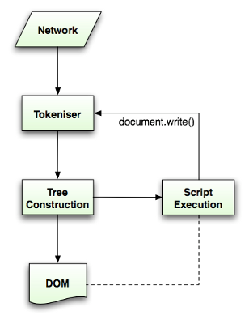

## 解析页面流程

---
1. 浏览器的高层结构
   1. 用户界面
      - 包括 地址栏，前进/后退按钮，书签设置，刷新和停止等，除了浏览器主窗口显示的外，其他都是用户界面
   2. 浏览器引擎
      - 用来查询及操作渲染引擎的接口
   3. 呈现引擎
      - 负责显示请求的内容，将解析后的内容显示出来
   4. 网络
      - 用于网络调用，其接口与平台无关，并为所有平台提供底层实现。
   5. 用户界面后端
      - 用于绘制基本的窗口小部件，其公开了与平台无关的通用接口，而在底层使用操作系统的用户界面方法。
   6. JavaScript 解释器
      - 用于解析和执行 JavaScript 代码。
   7. 数据存储
      - 持久层，浏览器需要在硬盘上保存各种数据
   
2. 主流程
   - 解析：将文档转化为编码可以理解的结构东西
     - 结果通常是代表文档结构的节点树，也就是解析树和语法树
     - 词法分析、
       - 将输入内容分割成大量标记的过程，标记即构成内容的单位，如字典的字母
     - 语法分析
       - 应用语言的语法规则的过程
     - 与上下文无关的语法
       - 解析的格式都必须对应确定的语法
     - 过程
       - **词法分析器** 将输入的内容分解为一个个个有效的标记，**解析器** 负责根据语言的语法规则分析文档结构
       - 解析是一个迭代，解析器向词法分析器请求一个新标记，若有语法规则匹配，解析器会将对应该标记的节点加到解析树上，然后继续下一个标记
         - 若没有匹配的，解析器会将标记存储到内部，继续请求，直到所有标记都能找到规则，若找不到规则，则报语法错误
     - 方法
       - 自上而下（高层结构向下找匹配结构）或自下而上（将输入内容逐步转为语法规则，直到满足高层规则）
     - HTML 解析 （非上下文无关文法）
       - 由DTD（文档类型定义）定义
         - 允许使用的元素及其属性和层次结构的定义
       - HTML 解析器的任务是将 HTML 标记解析成解析树
       - 解析器的输出 **解析树** 是由DOM元素和属性节点构成的树结构
       - 翻译
         - 很多解析树还不是最终结果，话需要翻译
         - 翻译是指将输入文档转换成另一个格式，如编译
         - 首先将源代码解析成解析树，然后将解析树翻译成机器代码文档
       - 解析算法
         - 标记化
           - 过程：将输入内容解析成多个标记。标记生成器识别标记，传递给树构造器，然后接受下一个字符来识别下一个标记，依次重复到结束
           - 算法：输出结果是HTML标记，每一个状态接收来自输入信息流的字符，并根据这些字符更新下一个标记。标记化状态和树结构状态会影响进入下一个状态的决定
         - 树构建
           - 层层解析，接收 html 符号并创建节点附加到根 Document 上
           - 然后接收 head，就算没有也会创建 head 节点附加到 Document 上
           - 接着接收 body 并创建节点附加上去
           - 然后接收 body 内部的并创建节点附加上去
           - 接收到 body 结束符，转移到 after body 模式，然后接收到 html 结束符，转移到 after after body
           - 当接收到文件结束符时，解析过程结束
     - CSS 解析
       - 将每个css文件解析为样式表对象
       - 每个对象包含css规则，css规则对象包含选择器和声明对象，以及其他一些符合css语法的对象
     - 处理顺序
       - 脚本
         - 一般是会阻塞页面解析，直到脚本解析完毕
         - 脚本是外引的，则必须先请求到这个资源（这同步的），会阻塞文档的解析直到资源被请求到
         - defer解决阻塞，异步让脚本使用另一个线程解析
       
       - 预解析
         - 在执行脚本时，其他线程解析文档，找出并加载通过网络加载的资源。资源可以在并行的连接上加载。不会修改DOM树，预加载解析器只会解析外部资源

       - 样式表
         - 脚本在文档解析阶段会请求样式信息，若当时还没有加载和解析好样式，脚本就会收到错误的回复
         - 样式表解析时会阻塞 Render 树渲染
         
     - 渲染树（Render树）构建
        - 由可视化元素按照其显示顺序而组成的树，也是文档的可视化
        - 在 Webkit，其中的元素被称为呈现器或呈现对象
        - 与 DOM 树的关系
          - render 树节点和 dom 树节点相对应
          - 非可视化的 DOM 元素不会插入呈现树中，如 head 元素等
        - 创建树的流程
          - 在 webkit 中，每个DOM节点都有一个 attach 方法，附加是同步的，将节点插入 DOM 树需要调用新的节点 attach 方法
          - 处理 html 和 body 标记就会构建呈现树根节点，其余部分以 DOM 树节点插入的形式来构建
        - 样式计算
          - 规则的层次
            - webkit（共享样式数据）
              - 需要是兄弟节点或表兄弟节点
              - 在同一鼠标状态内
              - 元素id不能相同
              - 标签名必须匹配
              - class属性必须匹配
              - 对应的属性必须相同
              - 焦点状态必须匹配
              - 链接状态必须匹配
              - 不能有元素被属性选择器影响
              - 元素不能有行内样式属性
              - 不能有生效的兄弟选择器
            - Firefox规则树
              - 样式上下文树
                - 所有匹配的规则都存储在规则树中，一条路径中的底层节点拥有最高的优先级，这棵树包含了所找到的所有规则匹配的路径
                - 不是一开始就计算所有节点，在某个节点需要计算样式时，才进行相应的计算并将计算后的路径添加到树中
                - 使用规则树计算样式上下文
                  - 若计算出规则树的一条路径，就用这条路径去填充，从底层开始遍历，直到填满
                  - 若没有规则定义，且若结构是继承型，就获取 parent 的结构
                  - 若特定节点添加了值，还需要额外计算转化为实际值
     - 布局（Layout）
       - Html 使用基于流的布局模型
       - 布局的坐标系统相对于根渲染对象，使用top和left坐标
       - 布局是一个递归的过程。它从根呈现器（对应于 HTML 文档的 <html> 元素）开始，然后递归遍历部分或所有的框架层次结构，为每一个需要计算的呈现器计算几何信息。
       - 根呈现器的位置左边是 0,0，其尺寸为视口（也就是浏览器窗口的可见区域）。
       - Dirty bit系统
         - 为了不因为每个小变化都全部重新布局
         - 一个渲染对象发生了变化或是被添加了，就标记它及它的children为dirty ―― 需要layout
       - 全局layout和增量layout
         - 全局layout是指触发了整个呈现树范围的布局
           - 影响所有呈现器的全局样式更改，例如字体大小更改
           - 屏幕大小调整
         - 增量layout
           - 只对 dirty 呈现器进行布局（这可能存在需要额外布局的缺陷）
           - 当呈现器为 dirty 时，会异步触发增量布局，如网络的额外内容添加到DOM树之后，新呈现器会附加到呈现树中
       - 异步和同步layout
         - 增量layout是异步执行的
         - 请求样式信息（例如“offsetHeight”）的脚本可同步触发增量布局
         - 全局layout往往是同步触发的
       - 布局处理
         - 父呈现器确定自己的宽度。
         - 父呈现器依次处理子呈现器
           - 放置子呈现器（设置 x,y 坐标）
           - 如果有必要，调用子呈现器的布局，会计算子呈现器的高度
         - 父呈现器根据子呈现器的累加高度以及边距和补白的高度来设置自身高度，此值也可供父呈现器的父呈现器使用。
         - 将其 dirty 位设置为 false
       - 换行
         - 若布局过程中旅需要换行，会停止布局，告知其父代需要换行，父代会创建额外的呈现器，并对其调用布局
     - 绘制（Paint）
       - 系统会遍历呈现树，并调用呈现器的“paint”方法，将呈现器的内容显示在屏幕上
       - 全局绘制和增量绘制
         - 全局（绘制整个呈现树）
         - 增量
           - 部分呈现器发生了更改，但是不会影响整个树。
           - 改变的渲染对象使其在屏幕上的矩形区域失效
           - 操作系统将其看作dirty区域，并产生一个paint事件
       - 绘制顺序
         - 元素进入堆栈样式上下文的顺序
           - 堆栈顺序
             1. 背景颜色
             2. 背景图片
             3. 边框
             4. 子代
             5. 轮廓（outline）
       - 动态变化
         - 原因：在发生变化时，浏览器会尽可能做出最小的响应
         - 元素的颜色改变后，只会对该元素进行重绘
         - 元素的位置改变后，只会对该元素及其子元素（可能还有同级元素）进行布局和重绘
         - 添加 DOM 节点后，会对该节点进行布局和重绘

3. 额外
   - 回流和重绘
     - 重绘（Repaint）
       - 浏览器元素发生改变，但不影响元素的布局
       - 只是影响了元素的视觉表现，并没有改变文档流中的位置或尺寸。
     - 回流（Reflow）
       - 当页面的布局或几何属性发生变化时
       - 浏览器需要重新计算元素的位置和大小
       - 对页面进行重新布局和绘制
     - 区别
       - 触发条件
         - 对页面进行重新布局和绘制
         - 回流发生在元素的尺寸、位置或整个文档的布局发生变化时
       - 影响范围
         - 重绘通常只影响一个或多个元素的视觉表现
         - 回流可能影响整个文档的布局，因为它需要重新计算元素的几何属性。
       - 性能开销
         - 重绘的性能开销较小，因为它只涉及元素的视觉更新
         - 回流的性能开销较大，特别是当回流影响范围较大时
     - 如何减少
       - 避免不必要的DOM操作
       - 批量修改DOM或样式
       - 使用CSS3的transform和opacity属性：这些属性能够利用硬件加速来减少回流和重绘的开销。

参考
- https://www.cnblogs.com/wyaocn/p/5761163.html
- https://www.cnblogs.com/iovec/p/7904416.html
- https://www.cnblogs.com/lhb25/p/how-browsers-work.html#Parsing_general