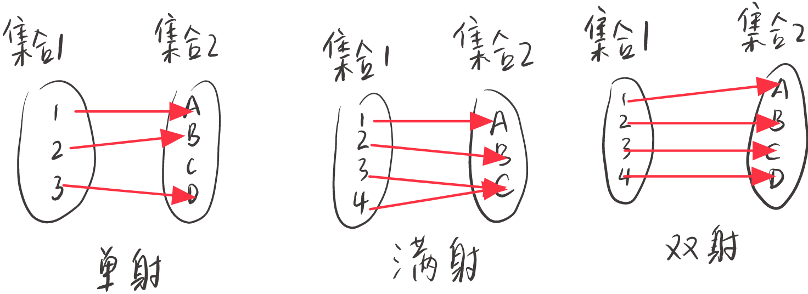

  
### 1、什么是映射   

**映**，照镜子，物体会映出来像，引申出像和原像，在之前例子中B是A的像，A是B的原像。    

**射**，从一个集合射到另一个集合，把集合1的元素A射到集合2的元素B，强调2个集合中元素之间的对应关系。

数学概念中映射还有2个额外基本要求    

一、集合1中的每个元素都得射一下，即集合1的元素在集合2中都有相应的像。

二、集合1的每个元素对应的像都是唯一的，一个物体不能通过镜子照出2个像。

注：二要求是映射的基本要求，集合1像的唯一性与后面单射的定义无关。集合2中有的元素可能没有被射到，即找不到相应的原像与之对应。

映射在射箭中，就是每个射手（集合1中的元素）都被要求只能且必须射一次箭（没有脱靶），靶子是集合2。

### 2、单射

单射的单是单独的意识，强调像的独占性。我（原像）的像只能是我的像，不能再是别人的像，即像的原像是唯一的。或者说集合1不同元素的像也是不同的。

单射时，集合2的元素数目大于等于集合1。好比射箭中被我射中的靶子不允许别人在射中，每个靶子上最多只允许一根箭矢，但是有的靶子上可能没有箭矢。

### 3、满射

满射的满强调射满了，即集合2的么个元素都有原像。此时集合1的元素数目大于等于集合2。每个靶子都被射了，有些靶子上可能不止一根箭。

### 4、双射

双射就是一一对应。既是单射又是满射。两个集合元素数目一样多。双射可构建一个新映射，即又集合2射回集合1，此时像和原像位置互相反了一下。

这个新映射称为双射的逆映射。逆映射的自然存在，体现双射中双的含义。好比射箭中每个靶子上都只有1根箭矢，而每根箭矢都是由不同的射手射出的。

