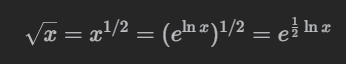

袖珍计算器算法
> 
```c++
class Solution {
public:
    int mySqrt(int x) {
        if (x == 0) {
            return 0;
        }
        int ans = exp(0.5 * log(x));
        return ((long long)(ans + 1) * (ans + 1) <= x ? ans + 1 : ans);
    }
};
```
二分法
```typescript
function mySqrt(x: number): number {
    let left = 0, right = x, ans = -1;
    while(left <= right) {
        const mid = Math.floor((left + right) / 2);
        if (mid * mid <= x) {
            ans = mid;
            left = mid + 1;
        } else {
            right = mid - 1;
        }
    }
    return ans
};
```
牛顿迭代法
> 求k值，找切点，不断接近目标点    
>    
```java
class Solution {
    public int mySqrt(int x) {
        if (x == 0) {
            return 0;
        }
        
        double C = x, x0 = x;
        while (true) {
            double xi = 0.5 * (x0 + C / x0);
            if (Math.abs(x0 - xi) < 1e-7) {
                break;
            }
            x0 = xi;
        }
        
        return (int) x0;
    }
}
```