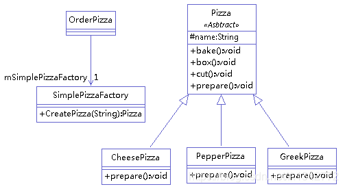

定义：定义一个工厂类，它可以根据参数的不同返回不同类的实例，被创建的实例通常都具有共同的父类

单一工厂类：通过一个具体的工厂类直接创建所有产品对象。

静态方法：通常通过静态方法（如 createProduct(type)）根据参数返回具体产品实例。

>   

```java
public class SimplePizzaFactory {
       public Pizza CreatePizza(String ordertype) {
              Pizza pizza = null;
              if (ordertype.equals("cheese")) {
                     pizza = new CheesePizza();
              } else if (ordertype.equals("greek")) {
                     pizza = new GreekPizza();
              } else if (ordertype.equals("pepper")) {
                     pizza = new PepperPizza();
              }
              return pizza;
       }
}
```

存在的问题和解决方法
- 问题：类的创建依赖工厂类。若想要拓展程序，必须对工厂类进行修改，违背了开闭原则。
- 解决方法：定义一个创建对象的抽象方法并创建多个不同的工厂类实现该抽象方法。需要增加新的功能，直接增加新的工厂类。
